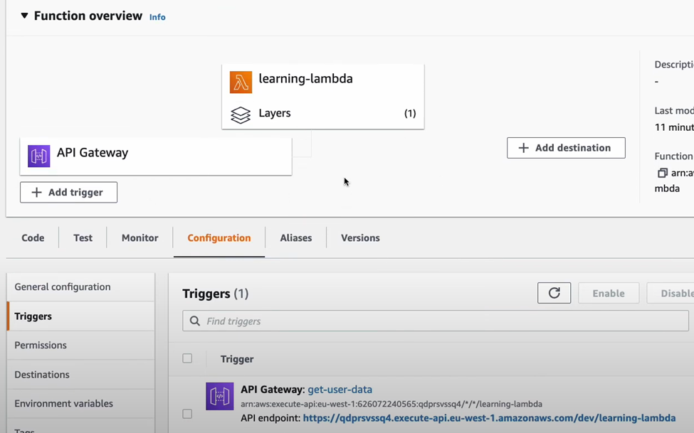

                                      AWS API Gateway + Lambda Integration Project

This project demonstrates the integration of AWS API Gateway with AWS Lambda, providing a serverless architecture for building and testing RESTful APIs. The API endpoints are designed to trigger Lambda functions, enabling dynamic execution of backend logic without provisioning or managing servers.

Key Features:
•	Serverless Architecture: Leveraging AWS Lambda to run code on-demand.
•	API Management: API Gateway handles HTTP requests, routing, and security.
•	Testing with Postman: Endpoints tested using Postman to verify API functionality and responses.
•	Scalable & Cost-Effective: Automatically scales with incoming requests; pay only for usage.
•	Sample Use Cases: Demonstrates CRUD operations, data processing, or simple business logic execution.

Technologies Used:
•	AWS Lambda (Python)
•	AWS API Gateway
•	Postman for API testing
•	AWS IAM for security permissions

Project Flow:
1.	Create a Lambda function to handle specific business logic.
2.	Set up an API Gateway REST API to expose endpoints.
3.	Integrate the Lambda function with API Gateway methods (GET/POST/PUT/DELETE).
4.	Test the API endpoints using Postman to ensure proper functionality.

Steps:
1.	Create a Lambda function
2.	Write down code
3.	pip install requests -r path_to_packag_direcory
4.	zip -r pypackages.zip pypackages
5.	create Lambda layer
6.	Attache the pypacakage Zip folder > layer created
7.	test the code.
8.	Create REST API
9.	Select Method > Get API
10.	Test API
11.	Enable CORS 
12.	Deploy API
13.	Copy link address and go to POSTMAN and past it >POSTMAN will try to call it
14.	Go to LAMBDA function and ADD trigger > API gateway

